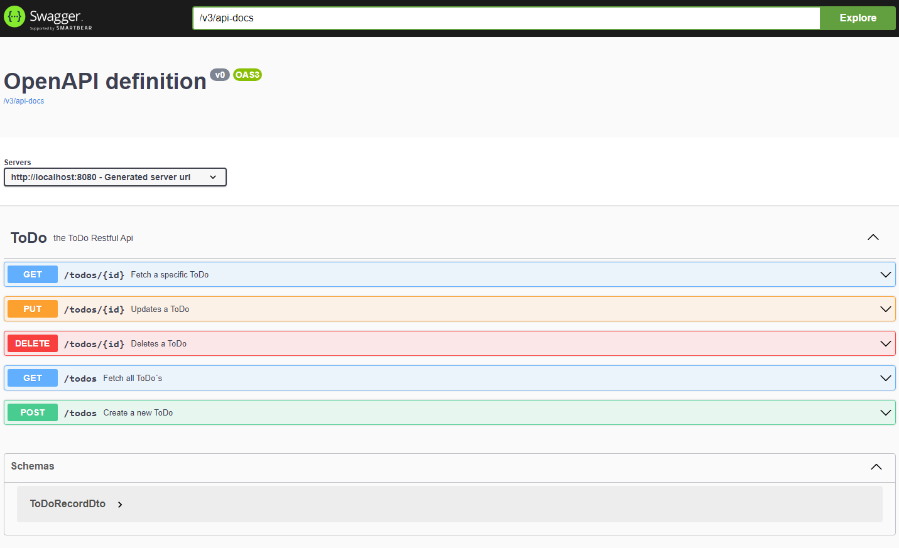

# ToDoList RESTful CRUD Application with Spring Boot

This is a simple RESTful CRUD (Create, Read, Update, Delete) application built with Spring Boot. It allows users to manage a todo list by performing CRUD operations on todo items.

## Features

- **Create**: Add new todo items to the list.
- **Read**: Retrieve a list of all todo items or retrieve a specific todo item by its ID.
- **Update**: Update existing todo items.
- **Delete**: Delete todo items from the list.

## Technologies Used

- Java
- Spring Boot
- Spring Data JPA
- HATEOAS (Hypermedia as the Engine of Application State) for RESTful services
- Hibernate for ORM (Object-Relational Mapping)
- PostgreSQL Database
- Maven for dependency management

## Project Structure

- `com.example.todolist.controller`: Contains REST controller classes responsible for handling HTTP requests and responses.
- `com.example.todolist.dtos`: Contains DTO (Data Transfer Object) classes used for transferring data between client and server.
- `com.example.todolist.entity`: Contains entity classes representing domain objects (e.g., ToDo).
- `com.example.todolist.exceptions`: Contains custom exception classes.
- `com.example.todolist.repository`: Contains repository interfaces for database CRUD operations.
- `com.example.todolist.service`: Contains service classes implementing business logic.

## Prerequisites

- Java Development Kit (JDK) installed - [Java JDK](https://www.oracle.com/br/java/technologies/downloads/) 
- Maven installed - [Maven](https://maven.apache.org/download.cgi)
- PostgreSQL installed - [PostgreSQL](https://www.postgresql.org/)

P.S: Be sure to set correctly the environment paths: ([Env Java](https://www.baeldung.com/java-home-on-windows-mac-os-x-linux), [Env Maven](https://github.com/Werbster-MT/To-do-List)) 

## Usage

1. **Clone the repository**:

    ```
    git clone https://github.com/Werbster-MT/To-do-List.git
    ```

2. **Configure PostgreSQL database**:

   Update the `application.properties` file in `src/main/resources` with your PostgreSQL database configuration.

    ```properties
    spring.datasource.url=jdbc:postgresql://localhost:5432/todo-list
    spring.datasource.username=your_database_username
    spring.datasource.password=your_database_password
    ```

3. **Import the project into your IDE** (e.g., IntelliJ IDEA, Eclipse).

4. **Navigate to the project directory**:

     ```
      cd your-path/To-do-List
   ```

5. **Run the application**:

    ```
    mvn spring-boot:run
    ```

6. **Access the application**:

   Open your web browser and navigate to [http://localhost:8080](http://localhost:8080) to access the application.

7. **Use the following endpoints**:

    - `POST /todos`: Create a new todo item.
    - `GET /todos`: Retrieve a list of all todo items.
    - `GET /todos/{id}`: Retrieve a specific todo item by its ID.
    - `PUT /todos/{id}`: Update an existing todo item.
    - `DELETE /todos/{id}`: Delete a todo item.

## Testing

To execute the unit tests for this project, follow these steps:

1. **Navigate to the project directory**:

   ```
      cd your path/To-do-List
   ```
   
2. **Run Maven test command**:

   Execute the following Maven command to run the unit tests:

   ```
      mvn test
   ```


## API Documentation with Swagger:
Swagger is integrated into this application for API documentation. You can access the Swagger UI to interactively explore and test the API endpoints.

1. Access the Swagger UI:
   ```
   http://localhost:8080/swagger-ui/index.html
   ```

2. Explore and test the endpoints:
   Use the Swagger UI interface to view the available endpoints, their parameters, and responses. You can also test the endpoints directly from the Swagger UI.

   

## Contribution

Contributions are welcome! If you find any bugs or have suggestions for improvement, feel free to open an issue or submit a pull request.

## License

This project is licensed under the MIT License - see the [LICENSE](LICENSE) file for details.
